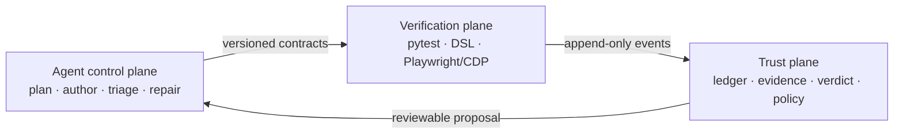

<p align="center">
  
</p>

<h1 align="center">Testence</h1>

<p align="center">
  <strong>Agent-first browser testing with evidence-backed verdicts.</strong><br>
  Agents author and investigate. A deterministic runner proves what happened.
</p>

<p align="center">
  <a href="https://github.com/kiselas/testence/actions/workflows/ci.yml"></a>
  <a href="https://pypi.org/project/testence/"></a>
  
  <a href="https://github.com/kiselas/testence/blob/main/LICENSE"></a>
  
</p>

<p align="center">
  <a href="https://github.com/kiselas/testence/blob/main/docs/en/README.md">English docs</a> ·
  <a href="https://github.com/kiselas/testence/blob/main/docs/ru/README.md">Документация на русском</a> ·
  <a href="https://github.com/kiselas/testence/blob/main/docs/en/demo-spec.md">Demo contract</a> ·
  <a href="https://github.com/kiselas/testence/blob/main/docs/en/benchmark/launch-protocol.md">Benchmark protocol</a>
</p>

Supported Python versions, operating systems and dependency floors are listed in the
machine-readable [support matrix](https://github.com/kiselas/testence/blob/main/support.json).

---

Testence turns a product claim into a reviewable `PlanSpec`, deterministic browser
test, structured evidence pack and typed verdict. Routine replay contains no LLM call
and no provider lock-in. The agent does the work that benefits from reasoning; the
runner does the work that must be fast and reproducible.

```text
feature or risk
      │
      ▼
agent plans ──► writes ordinary pytest ──► deterministic replay
                                                   │
                                                   ▼
human/policy ◄── reviewable repair ◄── evidence pack + verdict
```

## Why Testence

| | Traditional E2E | Interactive browser agent | Testence |
|---|---|---|---|
| Authoring | Human-heavy | Agent-driven | Agent-driven |
| Routine replay | Deterministic | Model-driven | Deterministic |
| Failure output | Logs and screenshots | Conversation | Versioned evidence pack |
| Healing | Manual or opaque | Session-local | Reviewable proposed diff |
| Model dependency in CI | None | Usually required | None |
| Verdict contract | Ad hoc | Prose | Typed and evidence-bound |

The key distinction is not “AI writes tests.” Many tools can do that. Testence makes
the complete agent workflow auditable: plan, claim, evidence, verdict and repair are
explicit contracts that another agent, a reviewer or policy can verify.

## Quick start

```bash
pip install testence
python -m playwright install chromium

testence doctor
testence init .
testence plan prepare .testence/specs/onboarding.md --project .
testence run --project . --run-id r-onboarding
testence inspect runs/r-onboarding

# see it catch a false green: the UI says saved, the API disagrees
testence run --project . --run-id r-demo-failure -- .testence/examples/test_demo_failure.py -q
testence report runs/r-demo-failure
```

`testence init` writes `testence.json` and a `.testence/` scaffold: one synthetic plan and
the tests that prove the loop. The scaffold is deliberately kept out of your existing
pytest paths, so initialization never opts your current suite into Testence. Conflicting
files are left untouched.

Render the run as a single self-contained HTML file, or run the complete green/failure
demo and both reports with one command:

```bash
testence report runs/r-onboarding
testence demo run --project testence-demo --json
```

Every command that takes `--json` also prints a readable summary without it. `doctor`
exits 2 when a check fails, `plan prepare` exits 3 when a scenario is blocked and 2 when
the plan or configuration is invalid.

### From a clone

```bash
git clone git@github.com:kiselas/testence.git
cd testence
uv sync --locked --extra dev --extra parallel
uv run playwright install chromium

uv run testence plan validate examples/specs/target-page.md --json
uv run pytest examples -q --testence-headless
```

`plan prepare` is the fail-fast gate before browser discovery. It checks each scenario's
engine capabilities, required oracle adapters and project prerequisites once, then returns
`ready` or explicit blockers with phase timings. Configure reusable, read-only checks in
`testence.json`:

```json
{
  "project_id": "shop",
  "base_url": "https://qa.example.test",
  "readiness": {
    "schema": "testence/readiness/1",
    "oracle_adapters": ["api", "custom"],
    "checks": [
      {"id": "credentials", "type": "env", "variables": ["TESTENCE_USER", "TESTENCE_PASSWORD"]},
      {
        "id": "seed",
        "type": "http",
        "path": "/api/qa/seed",
        "json_pointer": "/ready",
        "equals": true,
        "fix": {"argv": ["python", "scripts/seed_qa.py"], "timeout_ms": 120000}
      }
    ],
    "scenarios": {"checkout": ["credentials", "seed"]}
  }
}
```

Supported checks are `env`, project-relative `file`, and read-only `http`. HTTP checks
may assert a status and a JSON Pointer value. Secret values are never included in the
report. A blocked result exits with status 3; invalid plans or configuration exit with 2.
After reviewing a blocked report, `plan prepare --apply-fixes` runs only the explicitly
configured argument arrays without a shell and checks the failed prerequisites again.
Command output is discarded from the receipt so credentials cannot leak through tool logs.

Every generated file is bound by a scaffold manifest, and the machine-readable form of
each command above is available with `--json`.

Every failed test produces a bounded evidence pack containing the relevant UI state,
network and console signals, intent-bearing steps, independent oracle observations and
a verdict template. Render a standalone report with:

```bash
testence report runs/<run-id>
```

To integrate a real application, define a target profile in `testence.json`, keep
credentials in environment variables or `.env.local`, and run ordinary pytest:

```bash
TESTENCE_PROFILE=staging uv run pytest tests_e2e -q
```

Follow [Testing a UI feature](https://github.com/kiselas/testence/blob/main/docs/en/testing-a-feature.md) for the full workflow.

## Fast agent authoring

Keep the authenticated browser alive and attach short runs over CDP:

```bash
# terminal 1
uv run python -m testence.dev_browser --profile staging

# terminal 2: rerun on save without restarting Python or pytest
uv run testence watch --warm \
  -w tests_e2e -w src -- \
  python -m pytest tests_e2e/test_widget.py -k created_widget \
  --testence-profile staging-attached -q
```

Warm mode retains the Playwright/CDP engine connection while creating a new pytest
session, fixtures, auth context, run id and evidence writer on every iteration. Fresh
processes remain the required path for CI and release validation.

On the maintained production-built React profile, warm engine reuse reduced bootstrap
p50 from **2,808 ms to 447 ms** (−84.1%) and whole-run p50 from **3,447 ms to
1,133 ms** (−67.1%). See the
[result snapshot](https://github.com/kiselas/testence/blob/main/bench/results/warm_runner_latency.md),
[machine-readable budget](https://github.com/kiselas/testence/blob/main/bench/budgets/warm_runner_latency.json) and
[ADR-0018](https://github.com/kiselas/testence/blob/main/docs/en/adr/0018-warm-authoring-runner.md). Numbers are local engineering
evidence, not a cross-machine performance promise.

## Evidence, not runtime magic

A verdict is a versioned document bound to the plan, claims and captured run:

```json
{
  "schema": "testence/verdict/2",
  "project_id": "widgets",
  "case_id": "create-widget",
  "variant_id": "default",
  "attempt_id": "attempt-controller-1",
  "run_id": "r-20260906-120000-abc123",
  "proof_id": "proof-0123456789abcdef0123",
  "plan_digest": "sha256:aaaaaaaaaaaaaaaaaaaaaaaaaaaaaaaaaaaaaaaaaaaaaaaaaaaaaaaaaaaaaaaa",
  "test_digest": "sha256:bbbbbbbbbbbbbbbbbbbbbbbbbbbbbbbbbbbbbbbbbbbbbbbbbbbbbbbbbbbbbbbb",
  "policy_digest": "sha256:cccccccccccccccccccccccccccccccccccccccccccccccccccccccccccccccc",
  "pack_digest": "sha256:dddddddddddddddddddddddddddddddddddddddddddddddddddddddddddddddd",
  "plan_id": "widgets.create",
  "verdict": "real_bug",
  "test_id": "test_created_widget_is_visible",
  "confidence": 0.96,
  "summary": "POST succeeded, but the new row never appeared in the UI",
  "claim_results": [
    {
      "claim_id": "widgets.create.persisted",
      "status": "failed",
      "reason": "The persisted row is absent from the rendered collection",
      "evidence": ["oracle.json#/0"]
    }
  ]
}
```

When evidence is insufficient, the agent must abstain and state what is missing.
Locator healing follows the same rule: it creates a proposed patch with provenance and
confidence; it never silently changes the selector during execution.

## Agent-native by design

The package ships portable skills for four bounded jobs:

- `testence-plan` — turn a feature or risk into claims and a PlanSpec;
- `testence-author` — create deterministic tests and independent oracles;
- `testence-triage` — classify failures from bounded evidence;
- `testence-repair` — propose a reviewable change and prove it safely.

The same versioned skill pack is designed for Codex/ChatGPT, Claude Code, OpenCode and
other Agent Skills clients. Client adapters stay thin; the contracts remain portable.
Start from [AGENTS.md](https://github.com/kiselas/testence/blob/main/AGENTS.md), the shared entry point for any coding agent.
Optional `testence[visual]` adds digest-pinned viewport comparisons and manifested
expected/actual/diff evidence. The [client simulation](https://github.com/kiselas/testence/blob/main/bench/client_simulation/README.md)
exercises two adapter layouts from an installed wheel, including visual defects
and harmless controls.
See [Agent Skills](https://github.com/kiselas/testence/blob/main/docs/en/agent-skills.md) and the
[agent workflow](https://github.com/kiselas/testence/blob/main/docs/en/agent-workflow.md).

## Architecture



- `src/testence/contracts` — PlanSpec and verdict schemas with claim traceability;
- `src/testence/engine` — replaceable execution protocol and Playwright/CDP backend;
- `src/testence/dsl` — intent-bearing actions and exact-by-default assertions;
- `src/testence/evidence` — append-only `testence/2` ledger and bounded artifacts;
- `src/testence/triage` — evidence packs, verdicts and reviewable healing proposals;
- `src/testence/agent` — packaged, versioned, client-neutral skills;
- `bench` and `corpus` — real-React latency gates and seeded correctness defects.

Important decisions are recorded as bilingual ADRs with measurable tripwires:
[English](https://github.com/kiselas/testence/blob/main/docs/en/adr/README.md) · [Русский](https://github.com/kiselas/testence/blob/main/docs/ru/adr/README.md).

## Proof before claims

Testence keeps benchmark inputs, budgets and raw result snapshots in the repository.
The current proof surface includes:

- a production-built React latency gate for navigation, controlled inputs and mutation
  synchronization;
- a shared-browser and warm-runner benchmark for the authoring loop;
- a seeded mutation corpus for false-green, false-red and healing quality;
- a competitive replay protocol with frozen scenarios and environment disclosure.

Start with the [launch protocol](https://github.com/kiselas/testence/blob/main/docs/en/benchmark/launch-protocol.md) and
[benchmark corpus](https://github.com/kiselas/testence/blob/main/docs/en/benchmark/corpus.md). A number without its command,
environment and failure criteria is deliberately not treated as a product claim.

## Project status

Testence is in **alpha**: the workflow is complete, and APIs may still change between
releases. See the [changelog](https://github.com/kiselas/testence/blob/main/docs/en/CHANGELOG.md) and the
[roadmap](https://github.com/kiselas/testence/blob/main/docs/en/roadmap.md).

Evidence is redacted before it is written and again when it is exported; screenshot
masks and PII redaction are configured per project
([configuration](https://github.com/kiselas/testence/blob/main/docs/en/configuration.md#redaction-and-screenshot-masks)).
Review an evidence pack before sharing it outside your team. See
[SECURITY.md](https://github.com/kiselas/testence/blob/main/SECURITY.md) and
[CONTRIBUTING.md](https://github.com/kiselas/testence/blob/main/CONTRIBUTING.md).

## License

[Apache-2.0](https://github.com/kiselas/testence/blob/main/LICENSE). Runtime dependencies are restricted to permissive licenses. The
runner contains no LLM SDK and makes no call to a model provider during ordinary replay.
