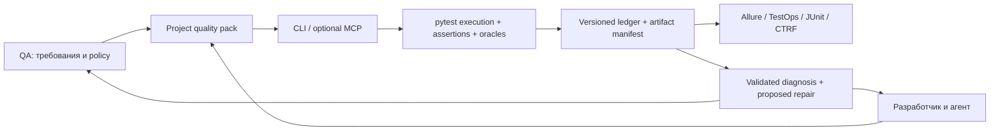

# Конечное ТЗ Testence R1: публичный web alpha для QA-команд

Версия ТЗ: 1.0 от 6 сентября 2026. База аудита: commit `493d81f`.
Целевая версия продукта: `0.1.0a1`, открытый developer/QA preview с явно ограниченной support matrix.
Статус: предлагаемая спецификация к реализации. Упомянутые целевые команды и схемы не следует считать уже реализованными.

Обоснование требований: [аудит](audit.md). Продуктовый пилот и выход к пользователям: [adoption.md](adoption.md). Очередь работ: [backlog.md](backlog.md).

## 1. Продукт и результат

Testence позволяет QA/SDET задавать проверяемые правила качества для нескольких веб-проектов, а разработчикам и агентам — создавать, выполнять и поддерживать UI-тесты в этих правилах. Код тестов и политики принадлежат команде. CI воспроизводит принятые тесты без обязательных model calls. Allure/TestOps остаются привычным местом результатов, истории и управления тестовыми запусками.

Главный пользователь решения и владелец качества — QA/SDET или QA lead. Частые операторы — разработчик, coding agent и CI. При переходе к модели «один QA на несколько проектов» продукт должен уменьшать ручное сопровождение и число повторных объяснений, сохраняя контроль над требованиями, рисками и исключениями.

### Definition of Done R1

Все требования R01–R24 ниже приняты, все gates G1–G8 пройдены на одном release candidate и подтверждены release manifest. Внешние подтверждения не заменяются внутренними goldens. Для публикации не требуется реализовывать R2/mobile, свой TMS или собственную облачную инфраструктуру.

Само открытие репозитория без прохождения gates допускает только статус исследовательского pre-alpha без заявления о готовности QA workflow. Широкий launch проводится после готовности R1 и пилота, а не одновременно с первым доступом к исходникам.

### Что обязано работать

- Новый проект и существующий pytest-проект, без переписывания всего suite.
- Chromium web execution на Windows/Linux; headless CI, изолированный режим по умолчанию, opt-in attached/warm для authoring.
- Plan → pytest test → assertions/oracles → evidence → reviewable diagnosis/repair → replay.
- Верные результаты всех pytest lifecycle outcomes и всех attempts.
- Allure Report, Allure TestOps selective execution/upload/history linkage; JUnit и CTRF.
- Один QA, три изолированных проекта, несколько разработчиков/агентов, общая версия quality policy, независимые секреты и артефакты.

### За пределами R1

Firefox/WebKit как гарантированная матрица; Android/iOS drivers; managed device/browser cloud; собственные case management, hosted dashboard, централизованный RBAC сервер; автономное изменение требований; полноценная платформа нагрузочного/API-тестирования; визуальный AI как обязательный verdict; генерация тестов на всех языках.

Существующие CI/TMS отвечают за пользователей, RBAC, scheduling и секреты. Testence отвечает за переносимые контракты, policy evaluation и корректность своего выполнения/артефактов. JSON config не является sandbox для произвольного Python-кода.

## 2. Пользовательские сценарии приемки

### U1. QA добавляет первый проект

QA устанавливает пакет в свой репозиторий, запускает doctor и init, выбирает существующие fixture/auth/seed adapters. Получает manifest изменений, synthetic example, policy, интеграционный рецепт и стабильный project ID. После demo видит корректный Allure result и проверяемые claims. Реальные credentials в сгенерированные файлы не попадают.

### U2. Разработчик поручает агенту проверить изменение

Вход: требование/bug/PR и разрешённый scope. Агент создаёт plan с expected outcomes, переиспользует проектные Actions/fixtures, пишет обычный test code. Принятие требует healthy/defect/control proof, а не единственного green. QA получает небольшой diff и список доказанных/непроверенных claims. Уровень review задаётся однажды политикой риска, без запроса разрешения на каждый безопасный шаг.

### U3. TestOps запускает выбранные тесты

QA выбирает случаи в TestOps. Adapter читает testplan, разрешает IDs/селекторы и выполняет только этот scope. Все результаты/attempts/attachments появляются в правильном launch/job-run, история cases сохраняется. Пустой/невалидный план не запускает весь regression suite. Ошибка теста не скрывается успешной загрузкой отчёта.

### U4. Агент разбирает failure и предлагает repair

Агент читает redacted pack и выдаёт typed diagnosis с точными references и неопределённостью. Product failure остаётся product failure. Locator repair — отдельный patch с base hash и proof runs. Изменение assertion, required claim, role, skip/retry policy требует соответствующего review. Тот же pack может принять другой совместимый агент.

### U5. Один QA управляет тремя проектами

Один quality pack подключён по фиксированной версии к трём репозиториям. В каждом — свои target, data namespace, owner и TMS project. QA фильтрует failures по project/service/owner/risk, видит coverage gaps и очередь решений. Обновление общего pack выполняется через три явных diff, локальные исключения сохраняются. Ни один run не читает auth/artifacts другого проекта.

## 3. Целевая архитектура и публичные контракты



Сохранить разделение engine/evidence/export и pytest-native код. Выделить application services `collect`, `run`, `inspect`, `validate`, `submit`, `export`: CLI и будущий MCP должны вызывать одну реализацию. Не создавать бизнес-логику отдельно для каждого agent client или экспортёра.

### Identity и provenance

| Поле | Значение и устойчивость |
|---|---|
| project_id | Явный repo-owned namespace; не зависит от абсолютного checkout path |
| case_id | Стабильная логическая сущность теста; rename файла не обязан создавать новый case |
| variant_id | Канонические параметры выполнения: browser, role, data variant; секреты не участвуют открытым текстом |
| run_id | Один запуск команды/CI job; уникален, не определяется поиском latest directory |
| attempt_id | Одна попытка case+variant; все retries отдельны |
| event_id | Уникален внутри run; сохраняет worker ID и локальную последовательность |
| claim_id / assertion_id | Продуктовое утверждение / конкретная исполняемая проверка |
| plan_digest / test_digest / policy_digest | Точные версии намерения, исполняемого scope и правил |
| sut_revision / environment_id | Версия SUT/окружения; unknown явно допустим, не подменяется SHA тестов |
| external_case_ids | TMS namespace → ID; не смешивать разные TestOps проекты |

Целевые breaking schemas: `testence/2` ledger, `testence/planspec/2`, `testence/verdict/2`, отдельные versioned run/pack/policy/proposal manifests. Старые `/1` читаются compatibility adapter, но отсутствие required proof данных помечается legacy/unverified. Не достраивать задним числом несуществующие наблюдения.

Ledger — источник записи фактов, но не криптографическая аттестация честности произвольного исполняемого кода. Digests обнаруживают рассогласование данных, а не заменяют доверенный CI, code review и защиту ключей.

### Две независимые оси результата

- Execution: `passed`, `failed`, `broken`, `skipped`, `aborted`, `not_run`; phase хранится отдельно. Xfail/xpass/retry/quarantine — отдельные атрибуты с reason и policy.
- Assurance: `verified`, `violated`, `inconclusive`, `unverified`. Диагноз причины (`real_bug`, `test_bug`, `ui_change`, `env_issue`, `unknown` в целевом контракте) не изменяет уже зафиксированный execution outcome.

`verified` разрешён только при полном требуемом scope, выполненных и успешных required assertions, отсутствии критичного нарушения policy и достаточном evidence. Тест может завершиться passed и иметь assurance=unverified; это не считается выполненным quality gate.

## 4. Требования исполнения и доказательств

### Методика тест-дизайна для QA и агентов

Planner заполняет applicability matrix: применимо / не применимо с причиной. Не создавать все комбинации механически. QA определяет critical journeys и выбирает слой, где риск дешевле и надёжнее проверить. E2E проверяет связность пользовательского пути, а не повторяет все unit cases через браузер.

| Метод | Обязательное рассмотрение | Проверяемый результат |
|---|---|---|
| Happy path + negative path | Каждый critical journey | Expected business state и ожидаемый отказ без побочного эффекта |
| Классы эквивалентности и границы | Формы, числа, даты, Unicode, пустые/максимальные значения | Минимальный набор representative inputs; явные boundaries и expected validation |
| Таблицы решений / роли | Permission, tenant, feature flags, combinations условий | Positive/negative access, отсутствие чужих данных и запрещённых mutations |
| Переходы состояний | CRUD, workflow, login/logout, asynchronous jobs | Допустимые/недопустимые переходы, reload/back, восстановление после сбоя |
| Persistence и независимый oracle | Сохранение, удаление, транзакции | Fresh authoritative read конкретной сущности и ожидаемого значения |
| Concurrency/idempotency | Повторная отправка, несколько пользователей, live updates | Lost update, duplicate entity, ordering, rollback; явные operation IDs |
| Metamorphic/property checks | Поиск, сортировка, пагинация, фильтры, сериализация | Инварианты между преобразованиями, например сохранение множества записей при сортировке; backend property cases могут жить вне UI |
| Mutation/control testing | Приемка нового critical test и repair | Тест обнаруживает заявленный дефект, проходит healthy/harmless controls и не скрывает дефект после repair |
| Fault injection | Target fixture и инфраструктура тестов | 4xx/5xx, timeout, abort, slow response, partial result, unavailable evidence дают правильный outcome |
| Exploratory testing агентом | Неясный scope и неизвестная UI поверхность | Charter, время/бюджет, observations и кандидаты сценариев; discovery не выдаётся за regression coverage |
| Visual/accessibility | Разметка, восприятие и keyboard UX | R1: ручное/внешнее доказательство с limitations; R2: versioned automated adapters, baseline review, отсутствие заявления «полная доступность» по одному scan |

Для каждого critical claim существует traceability `requirement → risk → scenario → assertion → run evidence`. Coverage отображает этот явно выбранный inventory; число тестов/кликов/посещённых страниц не выдаётся за процент покрытия всего продукта. Новая/изменённая requirement revision делает прошлое proof потенциально stale до review/replay. Несопоставленные требования видны QA как gaps.

### R01 · P0 · Полный lifecycle pytest

Вынести результат из финализатора `ex` в hooks сбора/исполнения/завершения. Фиксировать collect, deselect, setup/call/teardown, interrupted/worker-crash и session exit. Fixture `ex` остаётся интерфейсом действий, а не условием существования результата. Не менять обычную семантику pytest.

**Приемка:** consumer project с pass, assertion fail, setup fail до/после `ex`, teardown fail, skip на collection/setup/call, xfail, strict/non-strict xpass, collection error, Ctrl+C, worker crash, нулевой collection. Ledger, JSON summary, Allure, CTRF и JUnit согласованы по применимому mapping. Setup/teardown error не passed. Ни один started test без терминального события не passed. Marked test без `ex` отражён с честной proof completeness. Owner: core maintainer + SDET.

### R02 · P0 · Identity и попытки

Добавить IDs из таблицы. Сохранить full pytest nodeid как locator к исходнику. Result UUID строится из run+case+variant+attempt; history ID — из логической identity и стабильных параметров по mapping adapter. Пути артефактов включают hash identity и attempt; display name не является ключом.

**Приемка:** одноимённые функции в разных модулях/классах; 200 параметров; одинаковые первые 80 символов; имена с Unicode/разделителями; два проекта; retries; serial и `xdist -n 4` дают ожидаемое число разных cases/attempts и не смешивают steps/packs. Rename с сохранением case_id сохраняет TMS mapping; collision ID отклоняется до запуска. Зависимости: R01.

### R03 · P0 · Run manifest и completion gate

До исполнения записывать ожидаемый scope; после collection — collected/selected/deselected; после запуска — фактические outcomes, durations, pytest exit, run status, artifact paths. Writer фиксирует terminal events атомарно; reader восстанавливает целые записи до оборванного хвоста и отмечает повреждение. Missing worker и malformed middle record означают incomplete/corrupt, а не success.

**Приемка:** принудительно оборванный writer, пропущенный shard, лишний/дублированный event, missing test.end, export пустой директории, export во время записи и неверная версия схемы. Нулевой expected scope допускается только явно как no-op; неожиданный нулевой selected scope — ненулевой quality exit. Сводные counts не вычисляются из отсутствия failed events. Зависимости: R01–R02.

### R04 · P0 · Исполнимые claims и версии планов

PlanSpec включает requirement references, actor/role, risk, expected outcomes, preconditions, seed/cleanup references, required assertions/oracle kinds, scenarios и exclusions. Claim binding теста отделён от evidence конкретной проверки. Событие assertion содержит expected/actual либо redacted typed representation, outcome, oracle kind/source, claim IDs, время и source location.

**Приемка:** required API claim с пустым телом теста не verified; неисполнённая ветка assertion не покрывает claim; один step не доказывает все claims автоматически; optional claim не увеличивает required denominator; unknown/duplicate/missing IDs отклоняются. Оба schema validators и опубликованные JSON schemas принимают/отклоняют один corpus, включая дополнительные поля. Изменение плана создаёт новую revision/digest. Зависимости: R02–R03.

### R05 · P0 · Oracle contract: expected state, независимость, время

Сохранить UI/API helpers, расширить до проверки `expected → observed UI → observed authoritative state`. UI-only требования не обязаны иметь API oracle; для persistence/permissions нужен обоснованный источник. Oracle объявляет read-only nature, consistency model, deadline, identity пользователя/ресурса и причину выбора. Poll повторяет безопасное чтение до expected predicate; бизнес-действие повторно не отправляется.

Запрос связывается с действием через mark+method+origin/path+predicate/correlation ID. Поддержать JSON/GraphQL predicate без привязки к REST substring. Если backend отвечает 202/очередью, ждать бизнес-состояние в заданном deadline. Отрицательная проверка задаёт observation window. UI readiness проверяет требуемый state; два rAF не являются гарантией завершения бизнес-операции.

**Приемка:** optimistic UI без persistence; UI/API одинаково возвращают старое значение; пустой oracle; auth HTML вместо JSON; 401/403/404/500; aborted response; unrelated request к похожему URL; delayed commit; stale cache; rollback; pagination; role mismatch. Результат broken/inconclusive при недоступном oracle не превращается в real_bug без оснований. Записаны попытки наблюдения и deadline. Expected значения не вычислены из ответа, который они проверяют. Зависимости: R04, R06, R11.

### R06 · P0 · Авторизация и разделение проектов

API auth отправляется только на разрешённые origins с корректными cookie domain/path/secure semantics. Redirect на неразрешённый origin или HTTPS→HTTP не получает auth. Browser/API session lifecycle синхронизируется: login/refresh/logout/switch role. API oracles работают с объявленной ролью, не с произвольным снимком другой сессии.

Cache выключен по умолчанию; opt-in cache key включает project, origin, account/role, strategy и environment. TTL и identity probe обязательны. File permissions ограничиваются средствами ОС; секретные файлы не входят в evidence/export. Cache miss/corruption/другая роль не допускают тихого reuse.

**Приемка:** два локальных synthetic origins и redirect; несколько cookie paths/domains; expired/secure cookie; token refresh; logout; два пользователя одного host; два проекта одинакового host; недоступный probe; невалидные auth данные. Canary отсутствует в foreign origin, tracebacks, logs и экспортируемых артефактах. Секреты только через environment/secret refs. Owner: core + security reviewer.

### R07 · P0 · Capture policy, redaction и недоверенные артефакты

Создать единый sanitizer перед любым persist/export: URL query, headers, cookies, body, oracle expected/actual, error, console, ARIA, fingerprints, auth user и attachments. Body capture default-deny с per-target content-type/field/size allowlist. Полные `full-*` оригиналы не обходят policy. Redaction сохраняет тип и факт удаления, не выдаёт изменённое значение за исходное.

Для screenshot/video/trace отдельная политика: в safe profile отключены, пока не настроены и проверены masks/области capture; невозможно гарантировать безопасность изображения текстовым regexp. Screenshot failure/omission явно отражаются в manifest. Trace может содержать сеть/DOM; рассматривается целиком как чувствительный artifact.

Все внешние pack/export paths проверяются после resolve, включая symlink/junction. Запрет traversal/absolute/UNC/device paths вне artifact root. HTML экранируется, ссылки разрешены только безопасных схем. Документы SUT и evidence помечаются как данные для анализа, не инструкции агента.

**Приемка:** canary matrix покрывает каждый sink, переносы/Unicode/URL encoding и nested payload; zip/archive content проверяется после распаковки с bounds; hostile link/script/JSON fragment не выполняется. Подготовленный ledger не копирует соседние файлы. Redaction tests проверяют и полезность evidence: скрытие секрета не удаляет outcome/correlation/claim linkage. Зависимости: R02, R06.

### R08 · P0 · Bounded, переносимое и восстанавливаемое evidence

Pack содержит manifest schema, run/attempt/claim links, artifacts с size/hash/MIME, capture errors, truncation/redaction flags, retention и бюджет. Сохранять compact доказательства успешных required assertions; подробные failure artifacts — по policy. Run ledger не должен зависеть от оставленного живого браузера.

Проектные defaults: metadata summary ≤16 KiB; agent text pack ≤256 KiB UTF-8; capture ring ≤2000 records и ≤8 MiB на test; single admitted body ≤64 KiB; artifact pack ≤20 MiB на test; run storage ≤1 GiB. Это исходные инженерные ограничения, конфигурируемые с hard ceiling; изменение документируется benchmark. Счётчик bytes обязателен; оценка bytes/4 не называется точным token count. При overflow сохраняются failure/correlation references, обрезка явно снижает completeness при потере required evidence.

**Приемка:** 100 MiB response, long-running stream, 100k console events, много failures, диск заполнен, denied write, мёртвый browser. Capture не подвешивает test execution без дедлайна, причина failure не теряется из-за исключения pack assembly. Повтор export finished run идемпотентен; portable bundle можно перенести на другую ОС. Retention работает через dry-run, active/pinned runs не удаляются. Зависимости: R03, R07.

### R09 · P0 · Verdict и repair без подмены результата

Managed submit проверяет schema, run/attempt/plan/test/pack hashes, все required claim results, существование event/JSON pointer и согласованность с recorded assertions. Сохраняет revision verdict, author/model provenance где доступен, confidence как заявленную оценку, blocked_on и superseded reference. Статус runner не меняется от диагноза агента. Verdict может иметь abstain/unknown.

Repair proposal содержит base commit/file hashes, unified diff, scope, причину, changed assertions/policy, healthy+defect+control proof run IDs и решение reviewer. Применение атомарно, конфликт stale source отклоняется. Similarity fingerprint используется для candidate ranking, не для доказательства product bug. Пустая/недоступная страница и ambiguous candidates дают uncertainty.

**Приемка:** nonexistent pointer, чужой run, изменённый pack, stale plan/source, contradiction с failed assertion, model `confidence=1` без evidence, два похожих элемента, forbidden assertion weakening, добавление skip/retry, deleted feature, pack prompt injection. Непринятый repair не исполняется как часть CI replay; approved policy не требует повторного ручного согласования безопасных действий. Зависимости: R04, R07–R08.

## 5. Web runtime и эксплуатация

### R10 · P0 · Isolation, lifecycle и parallel execution

Default CI: fresh browser context/page на test либо явно объявленный изолированный scenario group; процесс browser можно переиспользовать. Shared/attached/warm — отдельные authoring profiles с метаданными fidelity/ownership. Seed namespace: project+run+worker+attempt. Cleanup в finalization, повторяемый и проверяемый; при аварии сохраняется список незавершённых ресурсов.

По умолчанию CI закрывает созданные процессы, не оставляет debug port. Attached режим не выбирает первую случайную вкладку; нужен target/origin/page identity и запрет совместного управления одним page несколькими workers. Не закрывать чужой browser/context.

**Приемка:** reorder suite, serial/`-n 4`, 50 warm reruns, два параллельных run, два пользователя, роли, popup, незавершённый request прошлого теста, interrupt, auth failure, worker restart. Нет cross-case storage/data/evidence leakage, нет роста числа принадлежащих runner процессов/страниц после завершения. Fresh/warm совпадают по outcomes; warm никогда не является единственным release proof. Зависимости: R01–R03, R06.

### R11 · P0 · Строгие действия и ожидания

Single-target действия/assertions требуют cardinality=1. Many-target assertions имеют отдельные count/all/any semantics. `.first`/`nth`, `force`, disabled motion и JS navigation допускаются как явный контракт с причиной и записью fidelity; critical user-interaction proof по умолчанию не снимает actionability.

Добавить expect value, enabled/disabled, checked, selected, exact count, attribute, URL, list content и typed predicate с deadline. Разделить ожидание наличия любого значения и ожидаемого значения. Application-specific router hacks остаются adapters; должны быть fallback и отдельный hard-navigation scenario.

**Приемка:** overlay/disabled button, duplicate accessible names, hidden duplicate, controlled React input, hydration, delayed navigation, spinner/background polling, DOM remount, пустое законное состояние, отрицательные проверки. Политика различает повтор наблюдения и повтор бизнес-действия. Зависимости: R04, R10.

### R12 · P1, обязательный R1 · Минимальная широта реального web UI

Поддержать публичные handles/capabilities для iframe (включая cross-origin средствами backend), open shadow DOM, new page/popup, dialog, file upload/download, keyboard/focus, viewport/device emulation. API escape hatch documented и явно помечает неподдержанную часть proof. Закрытый shadow root не заявляется поддержанным без отдельного backend.

**Приемка:** conformance SUT для каждого primitive, включая timeout/failure evidence и cleanup; активный frame/page связан с шагом. Cookies/authorization scoped корректно при popup другого origin. Один multi-user сценарий в отдельных contexts. Responsive emulation явно не называется тестом native Android/iOS. Зависимости: R10–R11, R22.

## 6. Интеграции с тестовой инфраструктурой

### R13 · P0 · Allure Report как полноценный consumer

Оставить export из ledger. Добавить case/attempt identity, statusDetails, parameters с secret exclusions, fixture containers, links, labels, suite hierarchy, owner, severity/risk, epic/feature/story, external IDs, project/environment/browser/revision metadata. Claim evidence, compact verdict и repair proposal прикладываются с устойчивыми links. Метаданные задаются Testence registry/markers/config; импорт существующих allure markers поддерживается только документированным adapter, без двойных results.

Совместимость с поддерживаемыми Allure 2 и Allure 3 подтверждается реальным generation/inspection fixture. Точные consumer versions фиксируются в release manifest. [Формат Allure](https://allurereport.org/docs/how-it-works-test-result-file/) — спецификация mapping, не доказательство текущей совместимости.

**Приемка:** все outcomes R01, nested steps, setups/teardowns, parametrized tests, retries, Unicode, attachments, serial/xdist. Реальный consumer строит report, показывает корректные counts, history и attempt boundaries. Повтор export не добавляет дубликаты. Golden alone недостаточен. Зависимости: R01–R04, R08–R09.

#### Обязательный mapping результата

| Источник | Allure execution | Дополнительные данные / quality gate |
|---|---|---|
| Call завершён, assertions успешны | passed | assurance separately; missing required proof блокирует verified |
| Assertion violation | failed | claim IDs, expected/actual, failure cause |
| Fixture/runner/infrastructure error | broken | phase, reason; не объяснять каждый broken продуктовым дефектом |
| Intentional skip / expected xfail | skipped | reason, owner, expiry/xfail metadata; не засчитывать как verified |
| Unexpected xpass | passed или failed по strict policy | обязательно unexpectedPass и policy finding |
| Started, killed/worker lost | broken | aborted/incomplete reason; отсутствующий terminal result не passed |
| Deselected/not_run | Не создавать фиктивный passed result | run manifest с expected/selected counts и scope gaps |
| Fail → retry pass | Все attempts, общий flake signal | первая неудача и evidence сохраняются |

### R14 · P0 · Allure TestOps в обе стороны

Реализовать testplan selection по `ALLURE_TESTPLAN_PATH`, Allure IDs и selectors; поддержать явно заданные mappings существующих cases. При неоднозначном ID/selector — diagnostic и stop; неизвестные required selection entries не пропускаются молча. План с ID и selector должен указывать одну сущность. TestOps запускает существующий CI job; Testence не копирует scheduler/RBAC.

Upload через `allurectl` с корректным launch/job-run context и project mapping. В R1 достаточно complete export+upload; `watch` разрешён, если результаты финализируются и появляются в наблюдаемой директории при его жизни. Full streaming каждого шага не обязателен. Retry upload использует manifest/receipt; после неясного сетевого ответа нельзя обещать exactly-once без серверного подтверждения — проверить launch перед повтором.

**Приемка в synthetic локальном adapter suite:** subset 3 из 20, parameters, empty plan, unknown ID, bad JSON, duplicate, ID-selector conflict, missing env, два проекта, xdist. В выбранном scope нет лишнего теста.

**Приемка в реальном тестовом tenant:** upload pass/fail/broken/skip, повтор launch/rerun, сохранение связи с существующим case и истории при migration, custom fields/labels, ссылки на run/case/issue, attachments, selective job. HTTP 401/403/429/5xx, timeout и partial upload имеют понятный recovery, тестовые результаты сохранены локально. Версии TestOps/allurectl, дата и обезличенный receipt входят в release manifest. До этого статус «локальные contract checks», а не «TestOps verified». [allurectl execution flow](https://docs.qameta.io/reference/ecosystem/allurectl/).

Зависимости: R02–R03, R13, R15. Owner: integrations maintainer + QA с тестовым TestOps tenant. Portfolio UX из R21 использует готовый adapter и не блокирует его разработку.

### R15 · P0 · CI, JUnit, CTRF и другие TMS

Поставить проверенные recipes для GitHub Actions и GitLab CI, документированный Jenkins pipeline. Везде один explicit run ID, отдельные test/export/upload statuses, always artifacts и финальная policy gate. Секреты берутся из CI variables. Успешный export не обнуляет ненулевой pytest exit.

JUnit генерируется pytest; adapter добавляет стабильные ссылки и согласует counts с manifest. CTRF экспорт проверяется опубликованной schema фиксированной версии, а не только self-authored golden. Различие statuses/attachments/links форматов явно описано. Историческая `SPEC_VERSION='0.0.0'` не является самостоятельным доказательством невалидности: целевую schema надо закрепить и реально провалидировать.

Для TestRail и Xray поставить import recipes + mapping fixture на основе JUnit: стабильные automation/external case IDs, ссылки на evidence, правило создания/обновления cases, запрет неявного перезаписывания ручного expected result. Прямая двусторонняя синхронизация всех TMS не входит в R1. Vendor-tested badge даётся только после live pilot конкретного adapter.

**Приемка:** red test + successful upload → red quality job; green test + unavailable TMS → локальные artifacts и отдельный delivery failure по policy; interrupted job сохраняет partial manifest; параллельные pipelines не берут latest чужого run; case mapping сохраняется между двумя imports. Внешние записи при будущих integration tests только в выделенный test project. [TestRail mapping](https://support.testrail.com/hc/en-us/articles/12609674354068-Code-first-workflow), [Xray results import](https://docs.getxray.app/space/XRAY/301435680/Integration%2Bwith%2BTeamCity).

## 7. Agent UX, измерения и выпуск

### R16 · P1, обязательный R1 · Typed CLI и portable agents

Целевые операции:

```text
testence doctor --json
testence agent init --client <supported-client> --dry-run
testence agent init --client <supported-client>
testence agent status --json
testence agent update --check
testence collect --json
testence run --project <id> --plan <path> --json -- <pytest selection>
testence inspect <run-id> --json
testence evidence get <attempt-id> --section <section> --json
testence verdict validate <file> --pack <path> --json
testence verdict submit <file> --run <id> --json
testence repair validate <proposal> --json
testence export <run-dir> --to <format>
```

Это целевой интерфейс. Сохранять старые команды с совместимыми aliases. JSON stdout содержит один versioned envelope `ok/data/error/run_id/artifacts`; progress идёт в stderr. Ошибки имеют code, retryable и actionable details без secrets. Для orchestration CLI: 0=gate pass, 1=test/proof gate failed, 2=input/policy, 3=environment/runner incomplete, 4=artifact/delivery; raw pytest exit сохраняется отдельно. Keyboard interrupt сохраняет системную семантику и aborted manifest. Другие команды не обязаны притворяться pytest.

Doctor проверяет Python/deps, browser install, writable temp/evidence, config, selected target, auth readiness без раскрытия значений, occupied ports и режим TLS; разрешён только preflight к заданному target. Init/update ведут version+hash manifest, не перезаписывают локальные изменения, поддерживают rollback и работают из wheel без сети. Политика проекта определяет auto-approved scope; skill не создаёт лишний approval на каждый шаг.

**Приемка:** одна end-to-end агентная сессия plan→author→proof→triage→repair на двух разных coding clients с одним pack; documented manual adapter для третьего. Client/version/model/caps фиксируются. Прямой и естественно-языковой invoke, broken setup, cancellation, prompt injection evidence, update conflict. Без агента принятый test воспроизводится. Optional MCP не блокирует R1; его будущий API строится поверх этих services. Зависимости: R03–R09. Финальная публикация руководств принимается в R20.

### R17 · P1, обязательный R1 · Performance, ресурсы и flake

Измерять separately cold process, browser/context, auth, setup, actions, assertions, capture, teardown, export, human review. Поддержать bounded timeout по run/test/action/oracle/capture и cancellation. Для flake identity включает SUT/env/test/policy revisions; изменение fixtures не прячется за hash одного test file. Rerun сохраняет attempts, quarantine требует owner/reason/expiry и не повышает proof completeness.

**Приемка на reference host** (4 vCPU, 8 GiB RAM, локальный SSD; точные OS/CPU/browser/versions в manifest):

- Текущие React launch budgets проходят ≥5 повторов; PR CI smoke ≥3, scheduled benchmark ≥30. P95 при малом n диагностический.
- 100k событий / 10k synthetic results: export+summary ≤30 s и peak RSS exporter ≤512 MiB; браузер не включён в этот memory budget. Сохранены исходные samples, counts и отказ от скрытой truncation результата.
- Replay suite 100 изолированных cases: результат serial и `-n 4` одинаков; scaling ratio публикуется, универсальное 4× не обещается.
- 50 warm reruns без накопления принадлежащих runner pages/processes; warm имеет только authoring статус.
- Canonical stable cases: 30 повторов, нет observed unexplained flake; CI interval и число case-runs опубликованы. Нулевое число observed flakes не называется доказанным нулевым population rate.

Оптимизация, ослабляющая oracle/actionability, не принимается как ускорение того же сценария. Зависимости: R08, R10–R12, R18.

### R18 · P0 · Независимый correctness evaluator

Объединить существующие corpora под общей entry point и manifest, сохранив separate static-heal и React strata. Evaluator сопоставляет expected scope, pytest outcomes, ledger completeness и независимо заданный ground truth. Он не доверяет одному pass/fail агрегатору Testence. Truth flags/patch labels не попадают в агентный input/evidence. Hidden holdout не применяется для tuning после freeze.

Минимум R1: 40 уникальных correctness cases — 20 продуктовых defects, 10 healthy/harmless controls, 5 repairable drift, 5 ambiguous/infrastructure cases. Включить optimistic success, lost update, delayed rollback, auth/role, wrong entity, empty oracle, stale data, duplicate locator, first-click swallowed, aborted mutation, lifecycle/identity/capture failure. Повторы не считаются новыми cases.

Дополнительно два OSS приложения на разных стэках: по три journey (create/persist, search/filter, update/delete) и healthy/bug/harmless revisions; truth review двумя людьми. Fixture/container/license/commit/reset scripts обязательны. Конкретные приложения выбираются в R23 discovery и фиксируются до заморозки; пользовательские частные приложения не публикуются.

**Приемка:** zero observed false green на release-critical defects, zero unsafe repair, healthy controls проходят, incomplete не green, ambiguous даёт reasoned abstention. Отдельно публикуются detection/right-reason/abstention/completion rates с denominator и intervals. Независимый человек воспроизводит deterministic subset. Test-runner mutants (pass по default, wrong identity, dropped oracle) обязательно обнаруживаются evaluator. Зависимости: R01–R05, R09–R12.

### R19 · P1, обязательный R1 · CI и дистрибуция

CI: Windows/Linux × минимальная поддерживаемая Python и текущая закреплённая; промежуточные versions — smoke либо явно меньший support tier. Заявленная нижняя граница Python/Playwright/pytest подтверждается separate dependency-minimum job. Не обещать поддержку всех будущих versions только по `>=`.

Проверки: format/lint/mypy, unit, consumer pytest integration, browser conformance, schema parity, corpus critical subset, React budget, build wheel/sdist, install wheel outside checkout, packaged skills/resources, docs examples, dependency/license/secret scan. Release jobs — signed/attested build provenance и trusted publishing там, где доступно, dependency inventory/SBOM, changelog и reproducible command manifest. Точные инструменты/права выбираются при реализации без включения runtime telemetry.

**Приемка:** clean install без Git/SSH credentials, первый test/report из установочного примера, отсутствие ссылок на локальные developer paths и незапакованные обязательные fixtures. CI потребляет собранный wheel хотя бы в одном полном smoke. sdist позволяет собрать эквивалентный package, его границы dev/test assets документированы. Нет известных untriaged critical dependency/security findings. Зависимости: R07, R12–R18.

### R20 · P1, обязательный R1 · Документация и миграция

Первый экран README: конкретный результат для QA, 90-second demo, install из package registry/HTTPS, две команды до local evidence, Allure/TestOps path, status/support matrix и ограничения. Блоки кода получаются из validated examples. Старый audit остаётся датированным архивом с ссылкой на новый; implemented/experimental/planned разделены.

Пути чтения: QA (policy/coverage/TMS), developer (feature test/run/CI), maintainer (extensions/schemas). Quickstart отдельно для Bash и PowerShell. Guides: attach vs isolated, auth/seed/cleanup, expected oracle, retries/quarantine, report delivery, multi-project, troubleshooting, migration/rollback. EN — обязательный внешний UX; RU синхронизирует нормативные контракты. Architecture/ADR — после первого успеха.

**Приемка:** все snippets выполняются/валидируются CI; локальные links целы; никаких `|| true` без сохранения test exit; no placeholders среди обещанных работающих команд. При установке в существующий pytest suite smoke без opt-in не ломается. Можно перевести один тест и вернуть его назад, сохранив TMS mapping; TypeScript-командам явно объяснены Python prerequisites и ограничение R1, без обещания автоматического transpilation. Один canonical support/launch manifest убирает противоречие количества agent clients. Зависимости: R13–R16, R19.

### R21 · P1, обязательный R1 · Multi-project quality pack

Repo-owned quality pack включает policy, labels/owner/risk conventions, oracle recipes, fixtures interfaces, compatibility versions и run selection rules. Project config ссылается на фиксированную версию; override имеет reason/owner/expiry. Один проект не получает credentials другого. Тесты и evidence namespaced by project. Основная очередь QA живёт в Allure/TestOps/CI; local JSON/HTML summary может группировать несколько manifests без копирования сырых секретных артефактов.

Разделить источник истины: требования/ручные case descriptions — QA/TMS; executable tests/plans/policy — Git; execution facts — immutable run; diagnosis/repair — versioned proposals. Import из TMS не overwrites исходник; синхронизация создаёт mapping/diff и отчёт конфликтов. Секреты refs принадлежат каждому проекту.

**Приемка:** U5 в трёх репозиториях; policy update с одним intentional conflict; одинаковые названия cases; разные owners/TMS projects; role/case/coverage filters работают; rollback pack не удаляет историю. QA видит only-actionable список: новое нарушение, missing proof, flake/quarantine expiry, rejected/awaiting repair. Retained artifacts недоступны через ошибочный namespace. Зависимости: R02, R04, R06, R14–R16.

### R22 · P1, обязательный R1 · Расширяемость без преждевременного mobile engine

Разделить minimal session/action/observation contracts и optional capabilities: browser navigation/network/DOM/frames/files, visual, accessibility, native touch/device. Capability negotiation на collect/preflight; unsupported action возвращает typed error и не становится silent skip/green. Credentials/exporters/oracles/seed adapters версионируются отдельно.

**Приемка:** conformance fake engine без CDP/DOM может пройти platform-neutral lifecycle/evidence/export тесты; browser-only операция корректно отвергается; public contracts не требуют Playwright type во внешнем adapter; совместимость старого custom engine объявлена или дана migration. R1 поставляет только web backend. Зависимости: R02–R04.

### R23 · P1, обязательный R1 · Пилот и проверяемая полезность

Выполнить пилот из [adoption.md](adoption.md): минимум три внешние команды, одна модель single QA/three projects, минимум пять новых пользователей и две независимые reproduction. Согласовать licensed OSS targets и case requirements, заморозить protocol. Сравнение — с хорошо настроенным pytest/Playwright + Allure и agent workflow; API oracle доступен обеим сторонам.

**Приемка:** 4/5 новых пользователей проходят demo ≤15 минут hands-off; ≥2/3 команд самостоятельно добавляют второй сценарий и возвращаются к продукту на следующей неделе; одна команда выполняет TestOps selective launch; нет known critical false green/leak/unsafe repair. Измерены QA review/triage minutes, setup effort, accepted scenarios, coverage gaps и review overrides. Числа — критерии принятия стратегии, не текущие результаты. При провале — исправление onboarding/scope или остановка рекламного launch. Зависимости: R14–R21.

### R24 · P1, обязательный R1 · Open-source release package

Сохранить Apache-2.0 как текущее решение, проверить права на включённые fixtures/datasets/assets и dependency policy. Публичные LICENSE/NOTICE при необходимости, CONTRIBUTING, CODE_OF_CONDUCT, SECURITY с действительным приватным каналом, roadmap, versioning/deprecation/migration policy, release notes, поддержка и issue templates. Провести scan дерева и истории до публикации; реальные sensitive artifacts не переносить в публичные demo.

Release manifest хранит RC SHA, versions, G1–G8 receipts, known limitations, checksums пакетов, corpus/protocol revision, compatibility certificates и инструкции rollback. Репозиторий не считает vulnerability-reporting channel существующим лишь по наличию текста в SECURITY.

**Приемка:** 90-second video и one-command demo воспроизводимы; package и docs доступны без обязательной регистрации; публичные заявления ссылаются на измеренные данные. Named maintainer отвечает на onboarding issues в заранее объявленное рабочее окно. Owner подписывает release decision после gates. Само ТЗ не является разрешением автоматически отправлять сообщения командам, публиковать packages или включать integrations в production. Зависимости: все предыдущие требования.

## 8. Release gates и свидетельства приемки

| Gate | Обязательный результат | Свидетельство | Принимает |
|---|---|---|---|
| G1 Truth | R01–R05; нет ложных pass от lifecycle/identity/missing proof | Consumer integration logs, evaluator mutants, manifest reconciliation | Core maintainer + независимый SDET |
| G2 Safety | R06–R08; canary/path/origin/cache/retention suite | Sanitized artifacts, negative tests, security review | Security reviewer |
| G3 Web reliability | R10–R12, R22; web conformance и isolation | Chromium Windows/Linux runs, serial/xdist parity, process cleanup | SDET |
| G4 Integrations | R13–R15, R21; реальные Allure reports и TestOps round trip | Consumer versions, synthetic mapping suite, live test-tenant receipt | Integrations owner + QA |
| G5 Agent workflow | R09, R16; два клиента, один pack, безопасный repair | Plans/tests/verdicts/proposals/runs, versions и caps | QA |
| G6 Measured quality | R17–R18; frozen corpus + 2 OSS apps + resource budgets | Raw samples, grader, denominators/intervals, reproduction | Benchmark owner + внешний reviewer |
| G7 Adoption | R20–R23; новый пользователь и повторное использование | 5 onboarding sessions, 3 team pilots, return usage | Product owner + QA champion |
| G8 Distribution | R19–R20, R24; clean package/docs/security/governance | CI RC SHA, wheel smoke, release manifest | Maintainer + product owner |

P0 gaps не waiver-ятся скоростью, размером suite или stars. Возможный scope downgrade оформляется новой версией ТЗ и честным release status; не помечается как выполненный R1.

### Общий формат задачи и приемки

Каждый R-ID превращается в issue с причиной из A-ID, scope, out-of-scope, owner, зависимостями, consumer-facing example, adversarial tests, compatibility impact и evidence link. Done: код+docs+consumer tests+review+receipt на RC. «Тесты зелёные» без указания того, что именно проверено, недостаточно.

## 9. Порядок работ и конечность объёма

1. **Truth/safety:** R01–R08 и исправление grader R18. Не расширять публичные обещания до этого.
2. **Integration foundation:** R02/R03 → R13–R15; параллельно по плану работ изоляция и web primitives R10–R12/R22.
3. **Usable QA loop:** R09/R16/R21, потребительский install/docs R19/R20, измерения R17/R18.
4. **External proof:** R23, обновление claims по данным, R24 и все release receipts.

Порядок не означает поручение запускать параллельных агентов; это зависимости задач команды. Сначала техническая оценка после R01–R08, затем календарный план. Рабочий ориентир для двух инженеров и одного SDET — несколько итераций порядка 8–14 недель плюс доступность пилотов; это оценка неопределённости, не обещанный срок. Identity/schema и tenant acceptance способны существенно изменить срок. Scope не увеличивается автоматически при обнаружении соседнего feature request.

## 10. После R1: границы следующего развития

| Этап | Содержание | Условие начала/завершения |
|---|---|---|
| R2 web beta | Firefox/WebKit projects; visual diffs с baseline approvals; a11y adapter; richer trace/timeline; full streaming и новые TMS adapters | R1 принят; спрос подтверждён пилотами; conformance/real-app matrix для каждого обещания |
| Ecosystem | Optional MCP; Playwright Test/TypeScript reporter/adoption adapter; remote providers; plugin marketplace | Первые интеграции реально используются; контракт evidence устойчив, миграция дешевле замены suite |
| Android pilot | Appium UiAutomator2 adapter, device/app reset, permissions, gestures, native accessibility, screenshot/logcat/crash | ≥2 команды с mobile задачами; web regression gates не деградируют; отдельный capability corpus |
| iOS pilot | Appium XCUITest adapter, simulator/real-device profiles, signing/provisioning, app lifecycle, alerts и native logs | Доступен macOS runner/device pipeline; отдельный budget и licensed test app |
| 1.0 | Объявленная стабильная API/schema/support matrix, migration guarantees и эксплуатационные SLO | Независимые пользователи, security review, поддерживаемая breadth фактически подтверждена |

Appium уже предоставляет разделяемые drivers и ecosystem; использовать adapter, не строить собственный mobile driver. iOS local execution требует соответствующей macOS/device инфраструктуры. Android/iOS не должны притворяться DOM-браузером; общий слой — identity, policy, assertions, evidence, verdict и export. [Appium](https://appium.io/docs/en/), [driver setup](https://appium.io/docs/en/3.3/quickstart/uiauto2-driver/).
