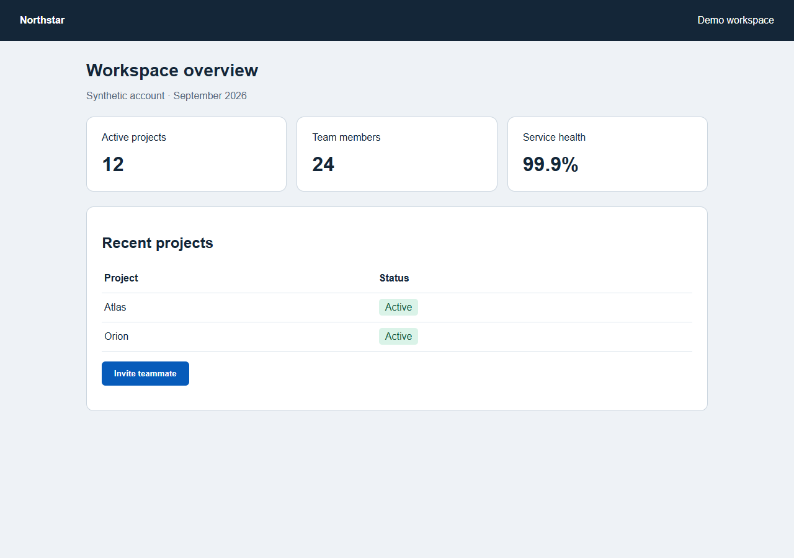
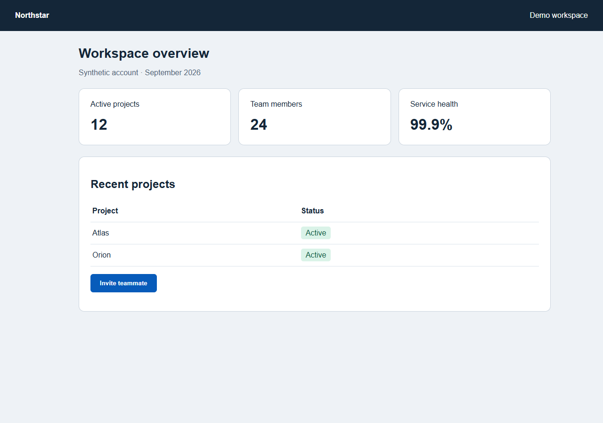
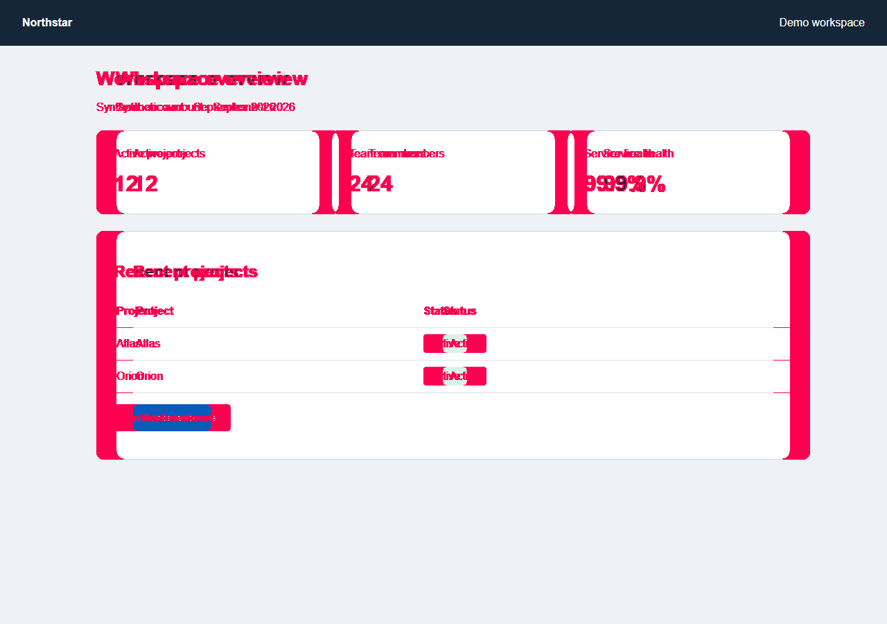

# Client simulation and autonomous visual regression

Runtime source: `eee0b4e264b064c4614115a5cce2132b99292acd`.
Status: completed engineering simulation; not independent external acceptance.

**430 tests passed, 2 skipped. All 10 hosted CI jobs passed**, including installed
wheel browser checks and the new visual-client jobs on Windows and Linux. Local
skips are the same Windows symlink privilege restrictions as the earlier audit.
[CI receipt](ci.json), [hosted run](https://github.com/kiselas/testence/actions/runs/34768647765),
[local summary](summary.json), [reproducible distributions](reproducible-build.json).

## What now works

`testence[visual]` provides a deterministic viewport oracle. A separate authoring
phase captures a new baseline, checks two identical frames, and returns a manifest
digest. `ex.expect_screenshot` binds comparison to the PlanSpec UI claim. The PNG,
profile and tolerances are pinned; replay cannot overwrite the baseline. It records
expected/actual/diff images, changed-pixel count and bounding box. Failed packs
manifest these artifacts for portable verdict validation.

Missing/tampered baseline, unsupported engine capability, changed environment,
unstable frames or transport failure cannot become a passed or violated visual
claim: the result is inconclusive. A completed disagreement under the frozen
contract is a violation. No LLM is called during replay.

Owned browsers accept explicit viewport settings, preserved through session reset.
Common CSS state predicates (`:checked`, type/value/expanded attributes) no longer
produce address-only healing proposals that would erase their state assertion.
This is a conservative guard, not a general proof of healing-classifier accuracy.

## Installed-client experiment

Four new projects installed and verified skill pack 0.1.2 from the exact wheel:
Codex/Claude layouts × desktop/mobile. Each has its own pytest configuration and
settings. Isolated Python and installed-package hashing exclude editable source
imports. Doctor, plan validation, baseline authoring, replay and verdict submission
are recorded in [client-result.json](client-result.json).

The accepted client test sees only the target, state and baseline digest. A local
server injects defects without editing the fixture. Random run IDs keep mutation
names out of pack paths and verdict templates; the label mapping stays in the
grader receipt. A separate scripted judge receives only a pack and applies the
fixed visual contract. It does not infer root cause or receive expected labels.

Two repeats, six phases, two viewports, two layouts and two UI states produced:

| Observation | Result |
|---|---:|
| Fresh pytest processes matching expectations | 48 / 48 |
| Bound cases | 96 |
| Verified healthy/harmless/restored cases | 56 |
| Correctly violated visual controls | 40 |
| Validated verdict submissions | 40 / 40 |
| Median two-case replay | 5,359.4 ms |
| Median scripted judgment plus submission | 644.6 ms |

The controls shifted content, made metric values invisible and clipped the mobile
layout while leaving semantic controls usable. A mobile-only defect stayed green
on desktop; an inert DOM refactor and restoration stayed green everywhere. Source,
plan and baseline hashes were unchanged throughout replay. Grading rejects missing
tests, skips, wrong failure reasons, unverified assurance and integrity failures.

These timings come from a local Windows host with other checks running concurrently.
They exclude package installation, baseline discovery/review and agent reasoning;
the judge is a script, so its timing is not an LLM latency claim.

The current Codex task inspected overview/dialog baselines at both sizes. Every
layout's baseline matches those reviewed PNG bytes, as recorded in summary.json.
Automatic capture itself is not independent baseline approval. Two client directory
layouts and a scripted judge are not two independent models or actual customer trials.

## Visible example

The synthetic overview below has a 28 px content shift. These are unmodified captured
images; the diff highlights affected pixels. Full gallery and dialog/mobile evidence:
`outputs/client-visual/blind-trial/report.html` (generate with the documented command).

| Baseline | Actual | Diff |
|---|---|---|
|  |  |  |

## External application probes

The same installed comparator was exercised on the pinned AdminLTE and Tabler builds
at desktop/mobile sizes: **16 comparisons matched expectations**, with four detected
card shifts and twelve healthy/DOM-only/restored controls. No checkout was edited.
The [receipt](oss-visual.json) records revisions, license/build-tree hashes, wheel
binding and PNG digests. These are supplemental comparator probes, not bound pytest
client acceptance; third-party screenshot assets remain in ignored local outputs.

## Failed attempts and limits

The full legacy collection corpus also completed in one non-interrupted invocation:
**51/51 outcomes matched**, with no misses or wrong reasons and healing proposals
retained for the renamed control. See [legacy-full.json](legacy-full.json). Expected
collateral claim failures remain explicitly recorded. This engineering run started
from the working tree during visual feature finalization; the corpus runner/spec/SUT
were unchanged. It is not an independent frozen R1 release-acceptance receipt.

The first client trial inherited parent pytest configuration and failed navigation.
The consumer now has its own `pytest.ini`. That interrupted attempt remains in
`outputs/client-visual/trial-1`; it was not retried into the successful receipt.
Earlier successful trials before the opaque run-ID boundary are also retained and
named in summary.json. The final receipt is a new complete experiment.

The new capability is baseline-based viewport regression. It does not autonomously
discover every screen, understand every design change, infer backend truth, or
provide complete accessibility/perceptual testing. Fonts and host rendering must be
controlled. A deliberate visual redesign still needs a reviewed baseline change.
Independent clients, external reviewers and pilot users remain separate release gates.

## Continue from the repository

Read [the portable author reference](../../../../src/testence/agent/skills/testence-author/references/visual-regression.md),
[client commands](../../../../bench/client_simulation/README.md),
[OSS commands](../../../../bench/oss/README.md) and [ADR-0023](../../../en/adr/0023-visual-baseline-proof.md).
Preserve old attempts; use new output directories and pinned baselines. The next
coverage expansion is backend-driven UI states, additional viewports and actual
client-agent execution using the same file contracts.
